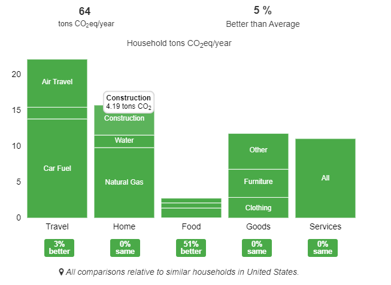

# Datacenter Ashley Thornton sp20-516-230

## E.Datacenter.1

The data center owned by eBay located in Salt Lake City, UT has a load of 18,000 kW [@ebay-sp20-516-230]. Using the Salt Lake City average cost of $0.08 per kWh [@electriccost-sp20-516-230], the annual cost of operating this center is approximately $12,661,704, or 12.6 tons of carbon emission. It was built in 2013. All electricity necessary to operate the data center is produced on site, making it unique.

## E.Datacenter.3

Based on the carbon footprint calculator (3), I personally produce 64 tons of carbon per year, which is 5% better than average. The main category is in food due to eliminating meat and dairy from my diet, with the rest of the categories being average or slightly better than average.

## E.Datacenter.4

Recycling is the process of reusing materials that would normally be waste. Many people recycle within their own homes, and companies purchase recycled material. They are able to reuse the material making into products such as clothing, shoes, and other consumer goods.

Within data centers, one of the largest forms of waste is heat. A variety of companies are recycling this heat waste by redirecting it to nearby buildings, greenhouses, and swimming pools (4). Some companies that recycle their waste heat include Telecity, Telehouse, IBM, Academica, Notre Dame, and Quebecor.

## E.Datacenter.5

An example of a country with renewable resource efforts is Iceland and its geothermal power plant, located on a volcano in Hellisheidarvirkjun. It is one of the largest geothermal stations in the world. It provides electricity to the entire city of Reykjavik, Iceland’s capital. It first began producing electricity in 2006, and has been expanded multiple times. Today, it produces 303 MW of electricity and 400 MW of thermal energy. The energy is created through steam coming out of 30 wells, each 2000-3000 meters deep (5).

A few years ago, I traveled to Iceland and had the opportunity to visit this power plant in person. While Iceland has a very high cost of living, our tour guide explained that Iceland's energy is extremely cheap due to this power plant. It is so cheap, in fact, that instead of turning down the heat when homes and businesses get too hot, residents simply open the door! I also learned that the energy from this plant is used to heat the streets and sidewalks of downtown Reykjavik, which I personally experienced was very effective. Even though I travelled to Reykjavik in the middle of winter, the streets and sidewalks of downtown were always free of snow.

## E.Datacenter.6

One technology used to cool data centers is chilled rack doors. These allow for the cooling of specific systems without impacting nearby units. These rack doors are filled with temperature-controlled water with programmable thermostats and work to cool the respective system through fans (6).

Another cooling technology is direct-to-chip cooling. These also use water to cool, but instead the water runs through pipes and directly to the motherboard. This technology is not as popular as chilled rack doors (6).

## E.Datacenter.7

The main lesson to take away from the Nature Article is an awareness of the impacts of humanity's desire and demand to have information and entertainment available at their fingertips. Datacenters are required to transmit data to users, and datacenters have a negative effect on the environment. While datacenters have made great strides to lessen their carbon emissions through hyperscale, essentially stripping servers down to the bare minimum needed, expected emissions are forecasted to increase dramatically as the demand for data continues to increase (7).

Additional information found is that companies' promises to shift completely to renewable energy sources are pacing slowly. For example, only 4% of Google's datacenters are powered by renewable energy, although they promised a 100% shift. China is a major contributor of carbon emissions due to its vast availability of cheap coal. Overall, the most effective way to reduce carbon emissions is by reducing demand for data (8).
